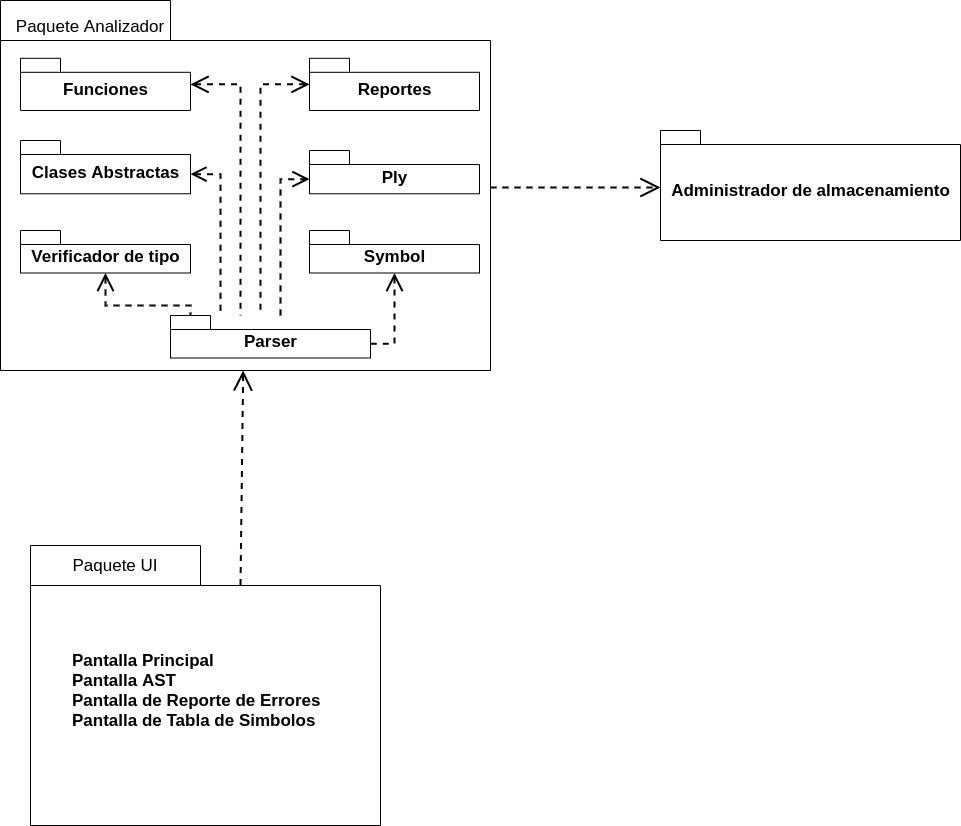
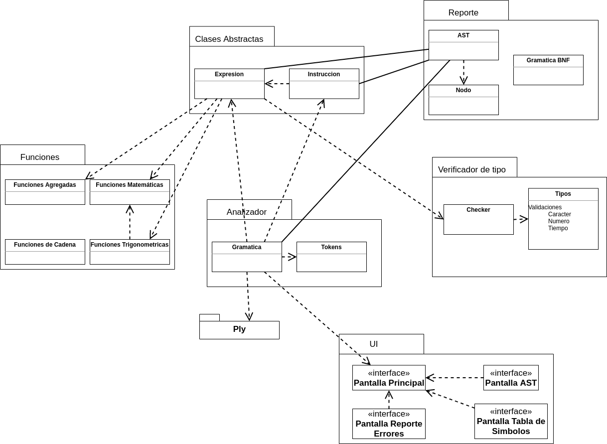
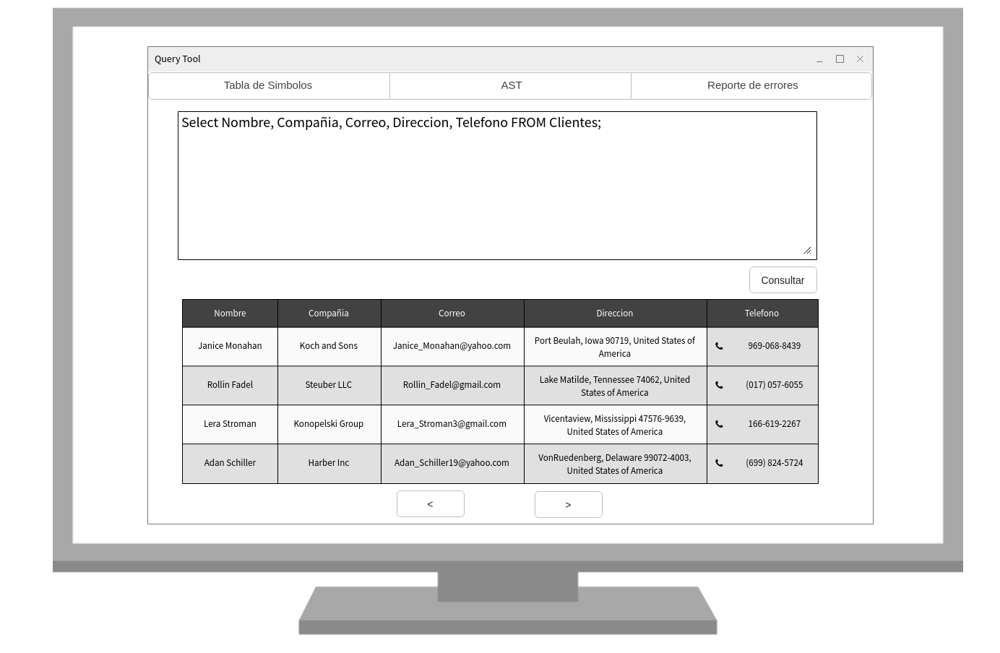
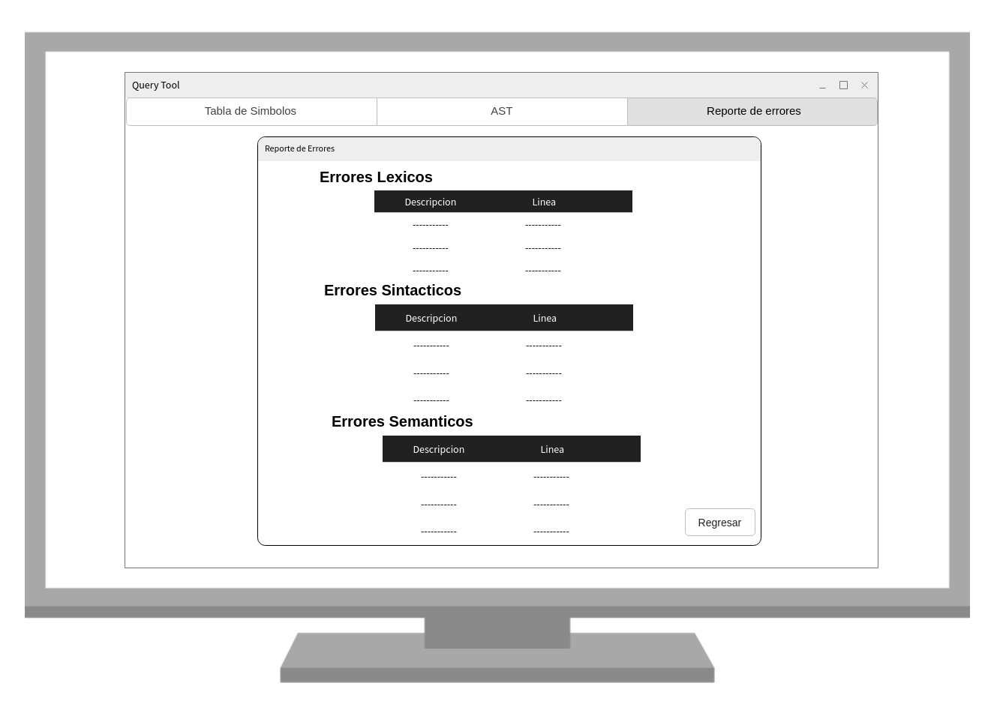
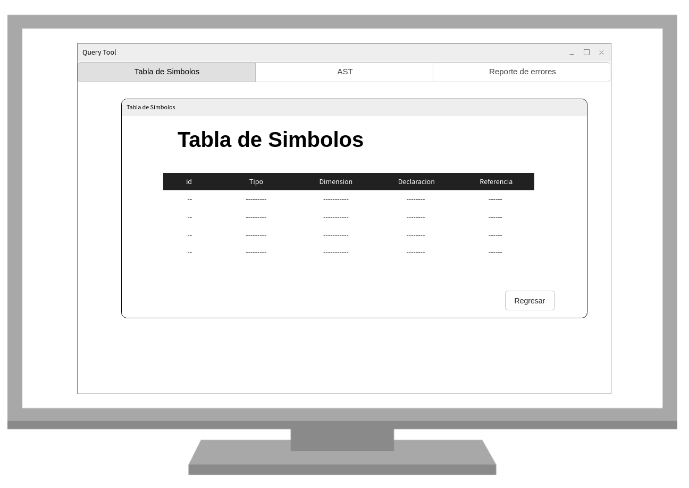
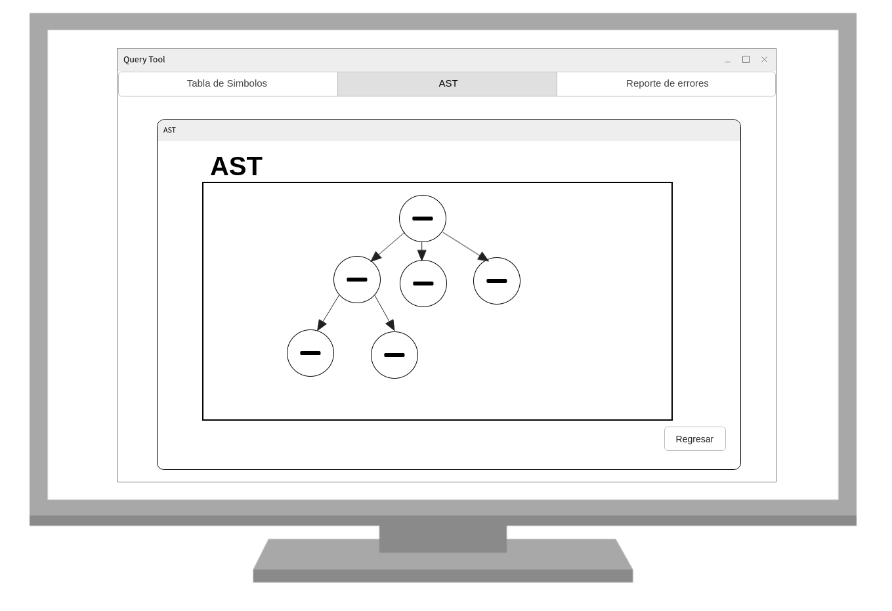

Universidad de San Carlos de Guatemala

Ingeniería en Ciencias y Sistemas

Organización de Lenguajes y Compiladores 2

Ing. Luis Espino

Aux. Juan Carlos Maeda 

#Manual Tecnico SQL Parser

Grupo 29

Quetzaltenango, diciembre 2020

##Introducción

El siguiente manual muestra una descripción clara y precisa de los procesos y herramientas que se utilizaron al momento de desarrollar el componente SQL parser de Tytus, un proyecto Open Source para desarrollar un administrador de bases de datos , así como también las funciones que tiene dicha aplicación, realizando un análisis, el cual recopila todos los requerimientos necesarios para su correcta funcionalidad.

Además se incluye una descripción y explicación del analisis lexico, sintactico y semantico el cual fue utilizado para la correcta manipulación de la información (inserción, actualización, eliminación,visualización), de esta forma se presenta un documento más completo para que facilite al programador su comprensión y futuro mantenimiento.

El objetivo del desarrollo de SQL parser, es interpretar sentencias SQL para manipular de manera correcta y eficaz la información.

##Objetivos

El objetivo del presente manual es entregar herramientas apropiadas para el futuro mantenimiento y mejoramiento de SQL parser

###Objetivos de SQL Parser
- Interpretar sentencias SQL

###Objetivos específicos de SQL Parser
- Invocar las funciones proporcionadas por el administrador de almacenamiento, para realizar operaciones sobre la base de datos.
- Manipular el resultado de las funciones para restringir y mostrar los resultados indicados por la/las consulta/s.
- Retornar información detallada de la consulta al servidor.

###Dirigido a
Personas que darán un futuro mantenimiento  a la aplicación, o personas que desean comprender el funcionamiento básico del mismo al momento de la ejecución.

##Herramientas utilizadas para el desarrollo

### Python 

Python es un lenguaje de programación interpretado cuya filosofía hace hincapié en la legibilidad de su código.​ Se trata de un lenguaje de programación multiparadigma, ya que soporta orientación a objetos, programación imperativa y, en menor medida, programación funcional.

### Visual Studio Code

Visual Studio Code es un editor de código fuente desarrollado por Microsoft para Windows, Linux y macOS. Incluye soporte para la depuración, control integrado de Git, resaltado de sintaxis, finalización inteligente de código, fragmentos y refactorización de código.

### Ply

PLY es una herramienta de análisis escrita exclusivamente en Python. Es, en esencia, una reimplementación de Lex y Yacc originalmente en lenguaje C. Fue escrito por David M. Beazley. PLY utiliza la misma técnica de análisis LALR que Lex y Yacc.  

### GitHub

GitHub es una plataforma de desarrollo colaborativo de software para alojar proyectos utilizando el sistema de control de versiones Git. GitHub aloja un repositorio de código y brinda herramientas muy útiles para el trabajo en equipo, dentro de un proyecto. Además de eso, se puede contribuir a mejorar el software de los demás contribuidores. Para poder alcanzar esta meta, GitHub provee de funcionalidades para hacer un fork y solicitar pulls. Realizar un fork es simplemente clonar un repositorio ajeno (genera una copia en tu cuenta), para eliminar algún bug o modificar cosas de él. Una vez realizadas las modificaciones se puede enviar un pull al dueño del proyecto. Éste podrá analizar los cambios que se ha realizado fácilmente, y si considera interesante la contribución, adjuntarlo con el repositorio original. 

##Descripción
SQL Parser al ser un componente de Tytus, proporciona la servidor una función la cual se encarga de interpretar sentencias del subconjunto del lenguaje SQL especificado en la documentación especificada en el siguiente [enlace][tytus]

[tytus]: https://github.com/tytusdb/tytus/tree/main/docs/sql_syntax

SQL parser está compuesto por 3 subcomponentes:
- Query Tool: es una herramienta gráfica en la cual se ingresan las consultas y se muestran los resultados, además de proporcionar mensajes de error si las consultas lo poseen.
	**Nota: La consulta abarca todo el contenido ingresado en el área de texto. (Ver figura 4)**

- Type Checker: Este subcomponente es un apoyo a SQL parser para la comprobación de tipos.
- SQL Parser: este subcomponente es el intérprete de las sentencias y consultas SQL y el que se conectara con el componente de administración de datos.

Figura 1. Descripción de la relación entre componentes

##Gramática 
Para el desarrollo de SQL parser se crearon 2 gramaticas una [descendente][des]  y una  [ascendente][asc].Se realizó un análisis de cada una verificando sus ventajas y desventajas de cada una, donde se llegó a la conclusión que la ascendente es la opción más viable debido a lo siguiente:

- Según la documentación de [PLY][ply] esta librería realiza un parseo LR, por lo que solo es compatible con gramáticas ascendentes.
- La gramática ascendente tiene menos producciones que la descendente, esto tiene como consecuencia:
	- Un tiempo de implementación más corto.
	- Un tiempo de parseo menor.
	- Menos nodos del AST, lo cual se traduce en menos espacio de memoria ocupado por el programa y un menor tiempo de ejecución.	
	- Menor probabilidad de errores en la implementación.
- La gramática ascendente presenta un menor nivel de complejidad, al no tener que acceder a la pila.
- La mayoría de los integrantes del grupo, poseen más experiencia implementando gramáticas ascendentes que descendentes. 

[des]: https://github.com/tytusdb/tytus/blob/main/parser/team29/docs/Gram%C3%A1ticas/gramaticaDESC.bnf

[ply]: https://www.dabeaz.com/ply/

[asc]: https://github.com/tytusdb/tytus/blob/main/parser/team29/docs/Gram%C3%A1ticas/gramaticaASC.bnf

##Diagramas de Modelamiento
###Diagrama de paquetes
SQL Parser posee los paquetes de UI, este posee un conjunto de ventanas las cuales sirven para recibir las consultas y mostrar la información procesada, y el paquete Analizador el cual recibe las consultas enviadas por el paquete UI, las procesa y ejecuta funciones  proporcionadas por la  interrelación con el administrador de almacenamiento, este  proporcionará los datos que se deberán manipular y ya manipulados serán mostrados por el paquete UI.

Figura 2. Diagramas de paquetes

###Diagrama de clases
El diagrama de clases está compuesto de las entidades y atributos que se crearon para el procesamiento de consultas y la manipulación de la información.

Figura 3. Diagramas de clases

####Analizador

- Gramática
- Tokens

####Funciones

- Funciones Agregadas
- Funciones Matemáticas
- Funciones Trigonométricas
- Funciones De Cadena

####Reporte

- AST
- Nodo
- Gramática BNF

####Clases Abstractas

- Expresión
- Instrucción

####Verificador de tipo
- Checker
- Tipos
	- Validaciones
		- Carácter
		- Número
		- Fecha

##Diseño  de reportes y pantallas
###Pantalla Principal
La pantalla principal cuenta con 3 secciones las cuales son:
- Barra de menús
- Área de Consultas
- Área de Visualización de Resultados y Errores

**Barra de menús**

Esta sección contiene 3 menús:
- Tabla de Símbolos: Se redirigirá a la pantalla de Tabla de símbolos
- AST: Se mostrará el AST generado
- Reporte de errores: Se mostrará la pantalla con los errores léxicos, sintácticos y semánticos

**Area de Consultas y Visualización de Resultados y Errores**

Contiene un panel de entrada en la cual se ingresa la consulta, y con el botón consultar se enviará la consulta al Analizador para que este posteriormente envíe los resultados y estos se visualizarán en el área de visualización de resultados y errores.

Figura 4. Pantalla principal

**Pantalla de Reporte de Errores**

Los errores léxicos, semánticos y sintácticos se mostrarán en 3 tablas diferentes con una breve descripción y la línea en donde fueron encontrados

Figura 5. Pantalla de Reporte de Errores

**Pantalla de Tabla de Símbolos**

En esta pantalla se muestran los datos de identificador, tipo, dimensión, ámbito de declaración y la referencia de las variables, funciones y procedimientos.

Figura 6. Pantalla de Tabla de Símbolos

**Pantalla AST**

En esta pantalla se muestra una imagen del árbol de sintaxis abstracta, realizado mediante la herramienta de Graphviz

Figura 7. Pantalla AST